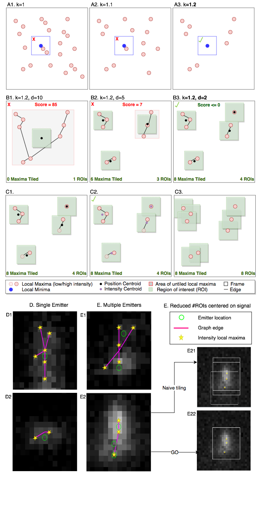
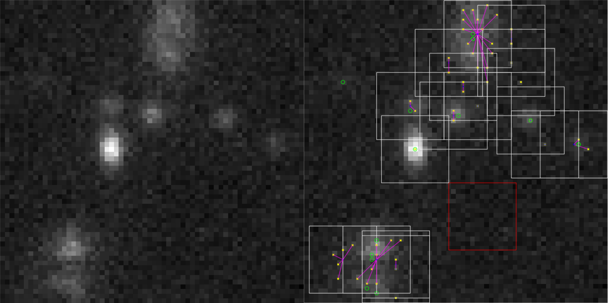
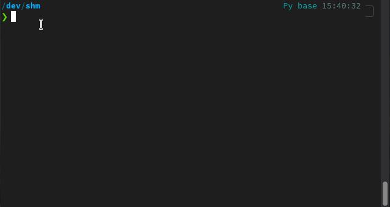

# ERGO: Efficient Recurrent Graph Optimized Emitter Density Estimation in Single Molecule Localization Microscopy

This repository holds the source accompanying our [IEEE Transactions in Medical Imaging 2020 paper](http://www.cs.sfu.ca/~hamarneh/ecopy/tmi2020.pdf).

### CI Tests
[](https://circleci.com/gh/bencardoen/ERGO.jl/tree/main)

### Coverage
[](https://codecov.io/gh/bencardoen/ERGO.jl)


# Table of contents
1. [Repository organization](#introduction)
2. [Installation](#install)
   1. [Singularity](#singularity)
   2. [Julia Package](#julia)
3. [Visualization of algorithm](#visualization)
3. [Potential use cases](#usecases)
4. [Data](#data)
6. [Running.](#running)

<a name="introduction"></a>
### Repository organization

[ERGO](https://github.com/bencardoen/ERGO) has 2 stages:
  - Localization : [ERGO.jl](https://github.com/bencardoen/ERGO.py)
  - Counting/Density estimation : [ERGO.py](https://github.com/bencardoen/ERGO.py)

This repository holds the Julia code for the emitter localization stage (GO).

All files in this repository are licensed under **Affero GPL v 3**, copyright 2018-2021 Ben Cardoen.
The software was developed in a multidisciplinary collaboration between the labs of Prof. Ghassan Hamarneh, Prof. Ivan Robert Nabi, and Prof. Keng C. Chou.

This project (ERGO) has 2 stages:
- Localization : ER**GO**.jl (this repository)
- Counting/Density estimation : **ER**GO.py https://github.com/bencardoen/ERGO.py

All files, with exception of the files in ./data, are licensed under [**Affero GPL v 3**](https://www.gnu.org/licenses/agpl-3.0.txt), copyright 2018-2021 [Ben Cardoen](https://orcid.org/0000-0001-6871-1165).

The software was developed in a multidisciplinary collaboration between the labs of [Prof. Ghassan Hamarneh](https://www.medicalimageanalysis.com/ghassans-bio), [Prof. Ivan Robert Nabi](https://www.bme.ubc.ca/person/ivan-nabi/), and [Prof. Keng C. Chou](https://www.chem.ubc.ca/keng-chou). This project could not have been realized without my other co-authors: Hanene Ben Yedder, and Anmol Sharma.

<a name="visualization"></a>
#### Visualization of algorithm




The manuscript explains the algorithm in more detail.


(Above) ERGO.jl applied to a single frame from a sequence. Left is the raw frame, and right is the processed frame. White bounding boxes indicate the ROIs ERGO centers around suspected emissions. Green are groundtruth locations of emissions (can be very faint).  Purple lines indicate the intensity weighting. Yellow are local maxima. Red is a 'noise' or 'negative' ROI, selected to contain with high confidence no emissions.

'Negative' ROI are useful for:

- Avoid selecting too much of the frame as signal
- Producing training data for the ER (deep learning emission density estimation) part.

Overlapping ROIs are intentional, to ensure each ROI is centered on a presumed emission. Postprocessing (density estimation, localization) can later process or reduce these ROIs.

Note how ERGO.jl only misses 1 emission, that is in intensity indistinguishable from background (top left corner).

<a name="usecases"></a>
#### Potential use cases:
- denoising : filter frame where density = 0
- enhance localization : knowing only k emitters are present, the localization problem becomes easier
- (real time) acquisition optimization : e.g. optimize 1 emitter per ROI for optimal localization & ideal signal separation

#### Performance
On a not so fast laptop with SSD, it's not unusual to get 250FPS in processing speed. Note that the code can be parallelized, and optimized in multiple places, drastically increasing FPS, but FPS of exceeding real time (60) is sufficient for our applications.


### Layout
- src
  - module source code
- notebooks
  - example usage (need jupyter)
To run the notebook examples, you need [Jupyter](https://jupyter.org/) and a [Julia kernel](https://github.com/JuliaLang/IJulia.jl).

<a name="data"></a>
### Data
You can download the data used at : http://bigwww.epfl.ch/smlm/challenge2016/datasets/MT0.N1.HD/Data/data.html

For your convenience, the data is provided (I make no claim or license to this data, rights belong to original owners) in folder ./data.

<a name="installation"></a>
### Installation

<a name="singularity"></a>
#### Singularity
Install [Singularity](https://sylabs.io/docs/).
To run Singularity on Windows, set up [WSL2](https://www.blopig.com/blog/2021/09/using-singularity-on-windows-with-wsl2/).

Then you have the option to either build (if you have sudo access) the image, or download a prebuilt one.
Both come with Julia 1.7.1 and ERGO code + all dependencies.
Download:
```bash
singularity pull library://bcvcsert/default/ergo_f35_j1.7:0.0.1
```
or build
```bash
sudo singularity build ergo.sif singularity.def
```
Then to execute code
```bash
singularity exec ergo_f35_j1.7:0.0.1.sif julia --project=/opt/ERGO.jl -e 'your code here'
```
Or use interactively
```bash
singularity shell ergo_f35_j1.7:0.0.1.sif
Singularity> julia --project=/opt/ERGO.jl # For interactive shell
```
<a name="julia"></a>
#### Local Julia
You need [Julia 1.6.2](https://julialang.org/downloads/) or higher.
This project was originally developed on v1.4.x, but I recommend v1.6.x > for speed and features.
Note that if you decide to use older version, please run the tests before you do anything else.

The below commands show the fastest way to get started.
```bash
mkdir newdir
cd newdir
julia> ]
> activate .
add https://github.com/bencardoen/ERGO.jl
instantiate
test ERGO
```
The ']' launches package manager, here we install in a new environment to ensure dependencies don't disturb your global Julia installation.
If the tests do not succeed, please make an issue with reproducible error.

The below screen recording shows how these instructions should look in execution



<a name="running"></a>
### Running
See notebooks/example.ipynb for a workflow used in the paper

Note that the notebook has extra dependencies (see notebook) not needed to run ERGO, but needed to display statistics, images, etc. Instructions to install those are at the top of the notebook.

Note: we run automated tests with travis on Windows and Linux, but Linux is the platform used to develop ERGO.jl.

If you use, or find this work useful, please cite the below paper:

```bibtex
@article{cardoen2019ergo,
  title={Ergo: efficient recurrent graph optimized emitter density estimation in single molecule localization microscopy},
  author={Cardoen, Ben and Yedder, Hanene Ben and Sharma, Anmol and Chou, Keng C and Nabi, Ivan Robert and Hamarneh, Ghassan},
  journal={IEEE transactions on medical imaging},
  volume={39},
  number={6},
  pages={1942--1956},
  year={2019},
  publisher={IEEE}
}

```


Note : reproduced figures are drafts of pre-submission versions, not published originals, and therefore under our copyright.
